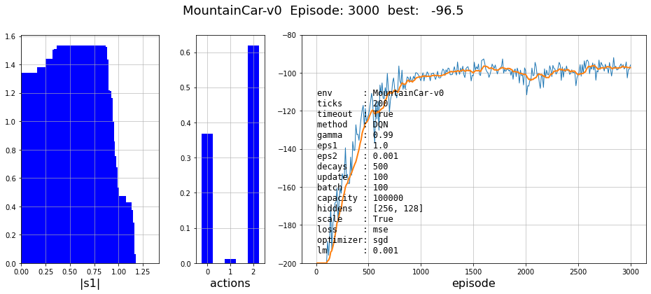
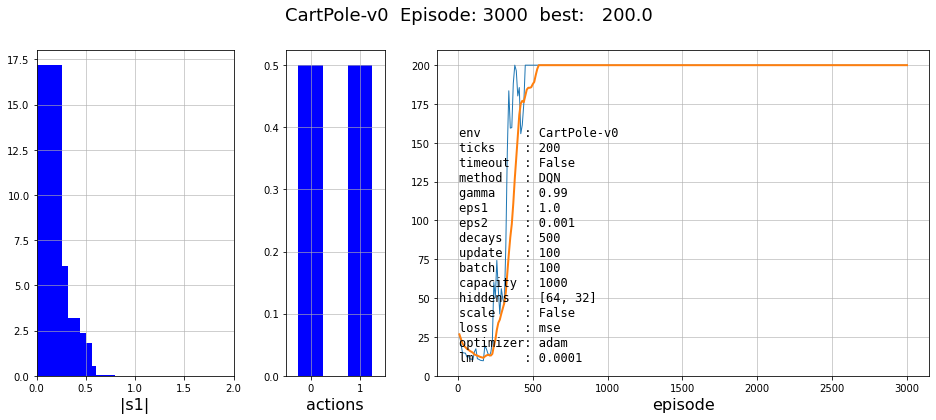
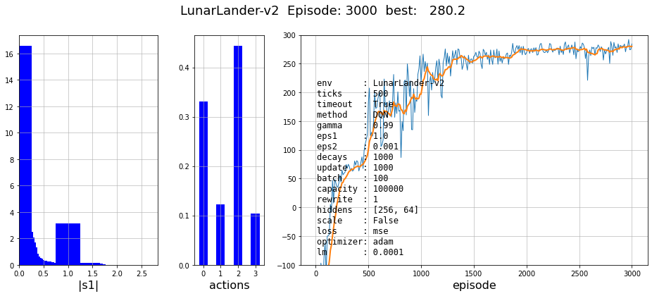

# DQN

In all figures, the first histogram is the distribution of the lengths of the state vector at the end of learning.
The second histogram is the distribution of actions in memory at the end of learning.
The third graph is the change in the average reward for the last 10 and 100 episodes in the learning process
and corresponding hyperparameters.

Exploring the **MountainCar-v0**, **CartPole**, **LunarLander** environments from the OpenAI Gym collection.
Other sets of hyperparameters can be found in the [notebook](Hyperparameters.ipynb).

## MountainCar-v0

## CartPole

## LunarLander-v2

