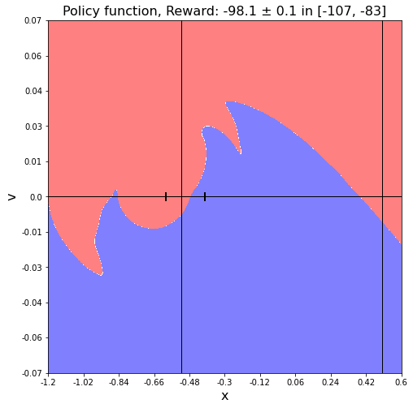
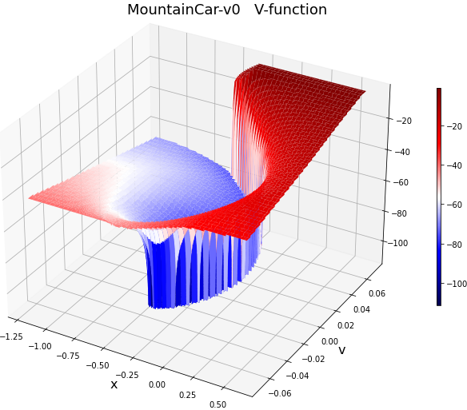

# The exact solution of the MountainCar problem

## Intro

A graph of transitions between states is built on a discrete grid in the [**MountainCar-v0**](https://www.gymlibrary.ml/environments/classic_control/mountain_car/) task.
It calculates "exact" value and  policy  functions.
Then they are approximated using neural networks.
The application of the neural network for the policy function is presented below (click on the image to launch):

<video src="im/MountainCar.mp4"  poster="im/MountainCar.png"  auto style="width: 500px; margin-left: 20px;" onclick = "this.currentTime = 0; this.play()"></video>

Following are the policy and value functions.
In the policy function figure, the blue area is action=0, the red area is action=2. The vertical lines correspond to the terrain minimum and the target coordinate. The markers on the horizontal line are the area where the car starts with equal probability (with zero speed).

